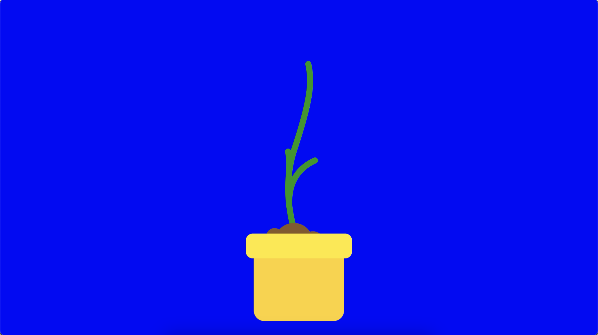
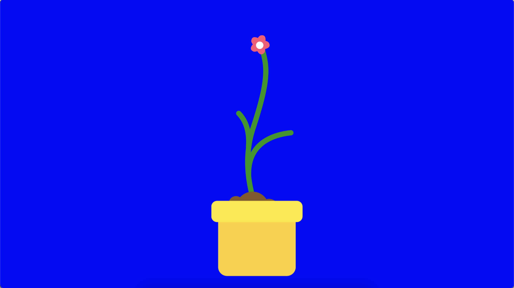

### 9103-quiz8
9103 quiz8
## Part1

[Link Text](https://www.vecteezy.com/video/2648350-animated-blooming-process-of-pink-flower-in-yellow-flowerpot)

This is a short animation of a plant growing out of the soil and then blooming into a flower. This animation inspired me to animate Shemza’s Apple Tree. In ‘Apple Tree’, I wanted to design the originally static and repetitive circular pattern to grow slowly like the plant in the animation, and finally the apple on it gradually unfolds. This allows the image to change and flow without destroying the original image structure. And this also fits the meaning of the artwork ‘Apple Tree’.

