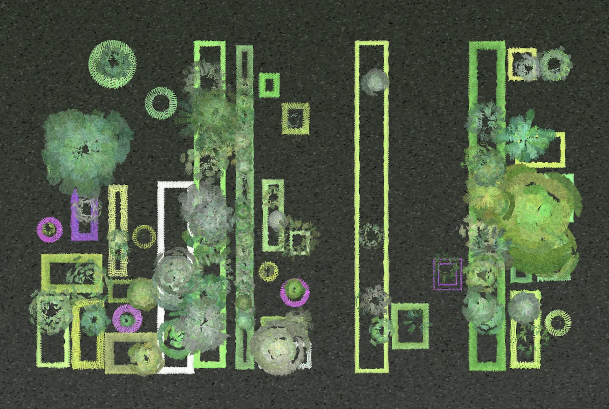

# 9103-quiz8

## Part1

[Animation Link](https://www.vecteezy.com/video/2648350-animated-blooming-process-of-pink-flower-in-yellow-flowerpot)

This is a short animation of a plant growing out of the soil and then blooming into a flower. This animation inspired me to animate Shemza’s Apple Tree. In ‘Apple Tree’, I wanted to design the originally static and repetitive circular pattern to grow slowly like the plant in the animation, and finally the apple on it gradually unfolds. This allows the image to change and flow without destroying the original image structure. And this also fits the meaning of the artwork ‘Apple Tree’.

## Part2

[Code link](https://www.vecteezy.com/video/2648350-animated-blooming-process-of-pink-flower-in-yellow-flowerpot)

This code uses recursive subdivision and parametric shape drawing to succulent plant forms in a layered, modular way. These techniques can help me realize the flower animation in Part 1. I can use SubdivideRect() to divide the area, so that there are different levels of layout. Then use PlantBowl to draw the petal-shaped graphics, and await sleep() can make the drawing present a rhythm of "slowly unfolding one part at a time", just like blooming.
